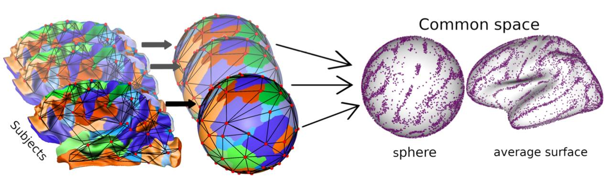
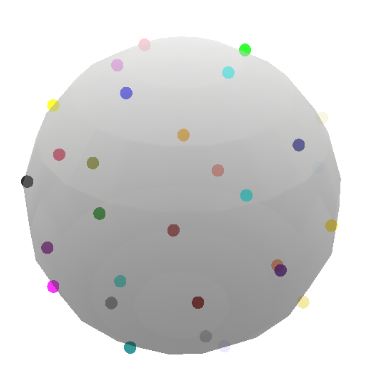
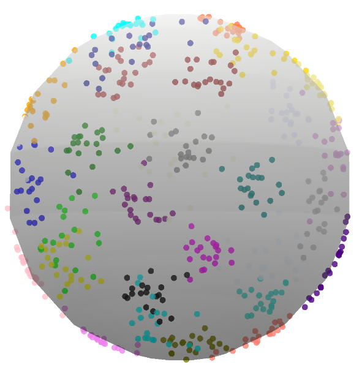
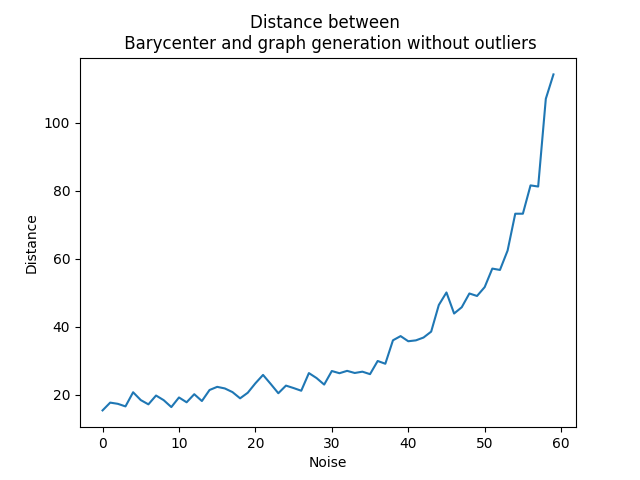

# GraphMatching



# Overview

The report explores various graph-matching methods using optimal transport, particularly in the context of analyzing <br>
cortical folds in neuroscience. It focuses on the Fused-Gromov-Wasserstein (FGW) approach, the Sinkhorn algorithm, <br>
the more advanced Sinkhorn-Newton-Stage (SNS) method, and the Fused-Unbalanced-Gromov-Wasserstein (FUGW) method. <br>
Test and enjoy :-) <br>
If any questions, please contact me at marius.thorre13@gmail.com <br>
For more detail have a look here: <a href="https://drive.google.com/file/d/1jGiuU9rUM_jvXeX_3qfwAkVScPohnsIl/view?usp=sharing" target="_blanck">Master Degree's 1 Internship Repport</a>

## Installation
Before compiling the report, you need to set up a Python environment and install the necessary dependencies.
```shell
conda create --name graph_matching python=3.10
```

```shell
conda activate graph_matching
```

```shell
pip install -r requirements.txt
```

## Introduction:
Overview of the importance of identifying cortex features in neuroscience.
Introduction to cortical folding and its representation through sulcal graphs.

1. Fused-Gromov-Wasserstein (FGW):
    - Detailed explanation of the FGW method, its formulation, and the algorithm used to compute graph similarity.
    - Comparison between the Sinkhorn and Sinkhorn-Newton-Stage (SNS) algorithms for solving the optimal transport problem.

2. FGW-Barycenter:
   - Explanation of how to compute a barycenter graph using the FGW method.
   - Experimental results showcasing the challenges of computing a barycenter graph in the presence of noise and outliers.

3. Fused-Unbalanced-Gromov-Wasserstein (FUGW):
    - Introduction of the FUGW method as a more robust alternative to FGW.
    - Description of the FUGW algorithm and its application to graph matching.
    - FUGW-Barycenter computation and experimental results.


   
## Graph generation
```shell
python graph_matching/demos/demo_graph_generation.py
```
Generate synthetic graphs that will be stored in the graph_generated directory. <br>
You can customize parameters to generate different types of graphs.
Noise value will create some space between nodes. <br>

## Display graph
After generating the graphs, you can visualize them using the following command. <br>
It will open an HTML file displaying the graph on a spherical mesh. <br>
You can interact with the graph in 3D using your mouse to rotate and zoom. <br>
Each node is color-coded according to its label. <br>
Here, an example of reference graph find in graph_generated folder created after having generated graphs: <br>




```shell
python graph_matching/demos/demo_display_graph.py
```

## Compute graph barycenter
From the list of generated graphs, you can compute a barycenter graph using two different algorithms:
- Fused Gromov Wasserstein:
```shell
python graph_matching/demos/demo_barycenter_fgw.py
```

If we compute barycenter on a big noise graph population and vice versa, we can find <br>
these visualisations: <br>



- Unbalanced Fused Gromov Wasserstein:
```shell
python graph_matching/demos/demo_barycenter_fugw.py
```

## Compare pairwise methods 
This script takes two graphs as input, computes the pairwise transport matrix using both barycenter methods, and compares them using Euclidean distance.
```shell
python graph_matching/demos/demo_pariwise_graph_analyse.py
```

For a more detailed visualization of noise in graphs, you can run the following command. <br>
It will allow you to select and compare two different HTML graphs interactively.
## Graph comparison
We can see on this script, node distance increasing between barycenter graph computed and <br>
graph used to create it, when we use FGW barycenter.



```shell
python graph_matching/demos/demo_graph_comparaison.py
```


```shell
python -m streamlit run graph_matching/demos/demo_graph_comparaison_stApp.py
```
## References
1. Sylvain Takerkart, Guillaume Auzias, Lucile Brun, and Olivier Coulon, "Structural Graph-Based Morphometry: a multiscale searchlight framework based on sulcal pits," *Medical Image Analysis*, vol. 35, pp. 32–45, 2017.

2. Rohit Yadav, "Development of normative and pathological models of cortical folding by machine learning on graphs," *AA*, 2023.

3. Zhen Zhang, Yijian Xiang, Lingfei Wu, Bing Xue, and Arye Nehorai, "Kergm: Kernelized graph matching," *Advances in Neural Information Processing Systems*, vol. 32, 2019.

4. Martial Agueh and Guillaume Carlier, "Barycenters in the Wasserstein space," *SIAM Journal on Mathematical Analysis*, vol. 43, no. 2, pp. 904–924, 2011.

5. Titouan Vayer, Nicolas Courty, Romain Tavenard, and Rémi Flamary, "Optimal transport for structured data with application on graphs," in *International Conference on Machine Learning*, PMLR, 2019, pp. 6275–6284.

6. Gabriel Peyré, Marco Cuturi, and Justin Solomon, "Gromov-Wasserstein averaging of kernel and distance matrices," in *International Conference on Machine Learning*, PMLR, 2016, pp. 2664–2672.

7. Marco Cuturi, "Sinkhorn distances: Lightspeed computation of optimal transport," *Advances in Neural Information Processing Systems*, vol. 26, 2013.

8. ENS DMA and ENS DI, "Du transport optimal et de son application en apprentissage statistique," 2020.

9. Xun Tang, Michael Shavlovsky, Holakou Rahmanian, Elisa Tardini, Kiran Koshy Thekumparampil, Tesi Xiao, and Lexing Ying, "Accelerating Sinkhorn algorithm with sparse Newton iterations," *arXiv preprint arXiv:2401.12253*, 2024.

10. Titouan Vayer, Laetitia Chapel, Rémi Flamary, Romain Tavenard, and Nicolas Courty, "Fused Gromov-Wasserstein distance for structured objects," *Algorithms*, vol. 13, no. 9, pp. 212, 2020.

11. Thibault Séjourné, François-Xavier Vialard, and Gabriel Peyré, "The unbalanced Gromov-Wasserstein distance: Conic formulation and relaxation," *Advances in Neural Information Processing Systems*, vol. 34, pp. 8766–8779, 2021.


## Authors
- Guillaume AUZIAS (INT)
- François-Xavier DUPE (LIS)
- Marius THORRE (INT, LIS)
- Rohit YADAV (INT, LIS)
- Sylvain TAKERKART (INT)

<div style="display: flex; justify-content: space-around;">
    
    
    
</div>