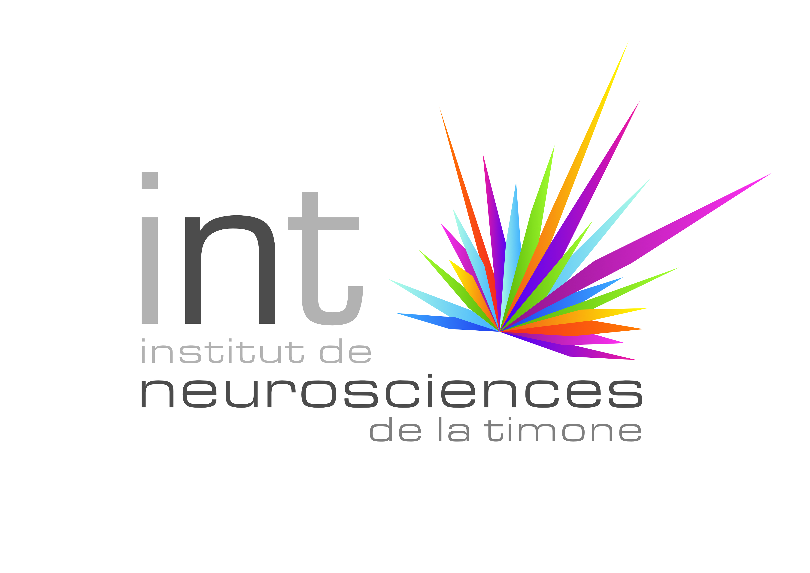

# GraphMatching


<div>
    
    
    
</div>

This toolbox contains scripts to generate Graph from real human cortex graph generated. <br>
Code has been rehabilited and tested by Marius Thorre using Rohit Yadav code. <br>
Demos are available in graph_matching/demos folder.
Test and enjoy :-) <br>
If any questions, please contact me at marius.thorre13@gmail.com


## Installation
```shell
pip install -e .
```

## Graph generation
Graphs generated will be store in graph_generated directory.
```shell
python graph_matching/demos/demo_graph_generation.py
```

## Compute graph barycenter
From list of graphs, compute barycenter graph.
```shell
python graph_matching/demos/demo_barycenter_fgw.py
```

## Display graph
After generated graphs, you can display them using this command:
```shell
python graph_matching/demos/demo_display_graph.py
```

## Graph comparaison
```shell
python -m streamlit run graph_matching/demos/demo_graph_comparaison_stApp.py
```

## Compare pairwise methods
After generated graphs, you can display them using this command:
```shell
python graph_matching/demos/demo_graph_analyse.py
```

## Authors
- Guillaume AUZIAS (INT)
- François-Xavier DUPE (LIS)
- Marius THORRE (INT, LIS)
- Rohit YADAV (INT, LIS)
- Sylvain TAKERKART (INT)