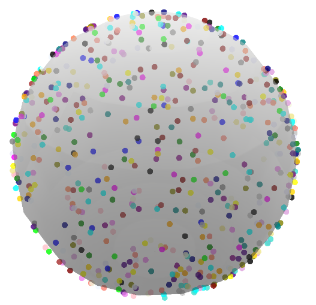

# GraphMatching


# Overview

The report explores various graph-matching methods using optimal transport, particularly in the context of analyzing <br>
cortical folds in neuroscience. It focuses on the Fused-Gromov-Wasserstein (FGW) approach, the Sinkhorn algorithm, <br>
the more advanced Sinkhorn-Newton-Stage (SNS) method, and the Fused-Unbalanced-Gromov-Wasserstein (FUGW) method.
Test and enjoy :-) <br>
If any questions, please contact me at marius.thorre13@gmail.com

Structure of the Report

The report is divided into several sections:

## Introduction:
Overview of the importance of identifying cortex features in neuroscience.
Introduction to cortical folding and its representation through sulcal graphs.

1. Fused-Gromov-Wasserstein (FGW):
    - Detailed explanation of the FGW method, its formulation, and the algorithm used to compute graph similarity.
    - Comparison between the Sinkhorn and Sinkhorn-Newton-Stage (SNS) algorithms for solving the optimal transport problem.

2. FGW-Barycenter:
   - Explanation of how to compute a barycenter graph using the FGW method.
   - Experimental results showcasing the challenges of computing a barycenter graph in the presence of noise and outliers.

3. Fused-Unbalanced-Gromov-Wasserstein (FUGW):
    - Introduction of the FUGW method as a more robust alternative to FGW.
    - Description of the FUGW algorithm and its application to graph matching.
    - FUGW-Barycenter computation and experimental results.


## Installation
Before compiling the report, you need to set up a Python environment and install the necessary dependencies.
```shell
conda create --name graph_matching python=3.10
```

```shell
conda activate graph_matching
```

```shell
pip install -r requirements.txt
```

## Graph generation
Generate synthetic graphs that will be stored in the graph_generated directory. <br>
You can customize parameters to generate different types of graphs.
Noise value will create some space between nodes. <br>



```shell
python graph_matching/demos/demo_graph_generation.py
```

## Display graph
After generating the graphs, you can visualize them using the following command. <br>
It will open an HTML file displaying the graph on a spherical mesh. <br>
You can interact with the graph in 3D using your mouse to rotate and zoom. <br>
Each node is color-coded according to its label.


```shell
python graph_matching/demos/demo_display_graph.py
```

## Compute graph barycenter
From the list of generated graphs, you can compute a barycenter graph using two different algorithms:
- Fused Gromov Wasserstein:
```shell
python graph_matching/demos/demo_barycenter_fgw.py
```

- Unbalanced Fused Gromov Wasserstein:
```shell
python graph_matching/demos/demo_barycenter_fugw.py
```

## Compare pairwise methods 
This script takes two graphs as input, computes the pairwise transport matrix using both barycenter methods, and compares them using Euclidean distance.
```shell
python graph_matching/demos/demo_pariwise_graph_analyse.py
```

For a more detailed visualization of noise in graphs, you can run the following command. <br>
It will allow you to select and compare two different HTML graphs interactively.
## Graph comparison
We can see on this script, node distance increasing between barycenter graph computed and <br>
graph used to create it, when we use FGW barycenter.


```shell
python graph_matching/demos/demo_graph_comparaison.py
```


```shell
python -m streamlit run graph_matching/demos/demo_graph_comparaison_stApp.py
```


## Authors
- Guillaume AUZIAS (INT)
- François-Xavier DUPE (LIS)
- Marius THORRE (INT, LIS)
- Rohit YADAV (INT, LIS)
- Sylvain TAKERKART (INT)

<div style="display: flex; justify-content: space-around;">
    
    
    
</div>